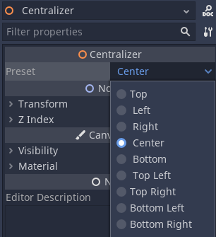

# Integrating the Centralizer Node into Godot Editor

To seamlessly integrate the new Centralizer node into your Godot editor, simply follow these straightforward steps:

### 1. Icon Placement
- Locate the icon file for the Centralizer node in your project directory.
- Move the `.png` icon from the `src` folder to the designated directory: `\editor\icons`.

### 2. Add Source Files
- Copy the `.cpp` and `.h` files of the Centralizer node from the `src` folder to the `\scene\2d` directory within your project.

### 3. Update `registry_scene_types.cpp`
- Navigate to the `registry_scene_types.cpp` file located in the `\scene` directory of your project.
- Inside `registry_scene_types.cpp`, perform the following actions:
  
  - **Include the Node Header**:
    
    ```cpp
    #include "scene/2d/centralizer.h"
    ```
  - **Register the Node after registering Node2D find it first 😎**:
    
    ```cpp
    ClassDB::register_class<Centralizer>();
    ```

Following these steps will seamlessly integrate the Centralizer node into your Godot editor environment, enabling smooth usage and enhanced functionality.

That's it! You're now ready to utilize the Centralizer node within your Godot projects. Happy coding! 🚀



This new node is an implementation of similar available node that does not inherit from control.h, in other words size of this node is 80% less in memory usage than normal one. And it has similar features as its original node with a new icon look.
